# Glaucoma Detection & Retinal Image Analysis

This project is a retinal image glaucoma detection system that highly integrates the **Vision Foundation Model (RETFound)**, **Knowledge-Enhanced Convolutional Block Attention Module (KE-CBAM)** combining anatomical priors, and **deep interpretability analysis**. The project provides a complete pipeline from ROI (Region of Interest) segmentation to anatomical domain prior feature extraction and classification, supporting evaluation and multi-classification tasks on multi-center large-scale datasets (such as UKB, SMDG).

## 🌟 Key Features

*   🤖 **Foundation Model Integration:** Deeply integrates **RETFound**, a vision foundation model in the medical retinal domain, providing more powerful and robust universal feature representations.
*   🧠 **Multi-Branch Attention Network:** Based on ResNet (e.g., ResNet152), integrates our proposed **KE-CBAM** attention modules. The model accurately aggregates global retinal and local optic disc (ROI) features simultaneously.
*   🔍 **Deep Interpretability System:** Provides fine-grained attention heatmaps using **Grad-CAM++** and high-dimensional feature dimensionality reduction clustering analysis using **openTSNE**, visually demonstrating the model's decision-making process.
*   🌍 **Multi-Center / Large-Scale Dataset Support:** Built-in scripts for preprocessing, prediction, and comprehensive generalization capability validation on authoritative external datasets such as UK Biobank (UKB) and SMDG.
*   📊 **Comprehensive Evaluation Matrix:** Equipped with an independent, comprehensive metric calculation system, supporting the generation of macro-metric evaluation reports and multi-level radar chart visualization evaluations.

---

## 🛠 1. Environment Setup

To avoid package conflicts among foundation model extraction, segmentation cropping, and training/evaluation tasks, this project divides the environment into three separate Conda virtual environments:

### ① Base Classification & Visualization Environment (Base Environment)
Used for backbone network training, evaluation, batch metric calculation, and **Grad-CAM++** / **openTSNE** visualization.
```bash
conda env create -n glaucoma_base --file environment.yml
conda activate glaucoma_base
pip install grad-cam opentsne matplotlib seaborn opencv-python Pillow
```

### ② Retinal ROI Segmentation Environment (AutoRetinalImageSegmentation)
Used to run the pre-trained retinal optic disc/cup segmentation network and image cropping.
```bash
cd AutoRetinalImageSegmentation
conda env create -n roi_seg --file environment.yaml
conda activate roi_seg
```

### ③ RETFound Foundation Model Feature Extraction Environment (RETFound Environment)
Create environment with conda and install dependancies.Used to run RETFound pre-trained weights and export feature matrices. 
```bash
conda create -n retfound python=3.11.0 -y
conda activate retfound
pip install torch==2.5.1 torchvision==0.20.1 --index-url https://download.pytorch.org/whl/cu121
git clone https://github.com/rmaphoh/RETFound/
cd RETFound
pip install -r requirements.txt
pip install ipykernel
python -m ipykernel install --user --name retfound --display-name "Python (retfound)"
```
For detailed configuration of the RETFound environment, or to download the RETFound pre-trained weights, please refer to the official repository: [https://github.com/rmaphoh/RETFound_MAE](https://github.com/rmaphoh/RETFound/tree/main).


---

## 📂 2. Dataset Preparation

### Training and validation dataset
The dataset should be arranged as this:
	
	Training and validation dataset
		|- train(90% of downloaded dataset)
			|_ 0_neg # save the full images
				xxxx.png
				...
			|_ 1_pos
				yyyy.png
				...
			|_ 0_roi # save the ROI images
				xxxx.png
				...
			|_ 1_roi
				yyyy.png
				...

		|- val(10% of downloaded dataset)
			|_ 0_neg 
				xxxx.png
				...
			|_ 1_pos
				yyyy.png
				...
			|_ 0_roi
				xxxx.png
				...
			|_ 1_roi
				yyyy.png
				...
### Testing dataset
Before testing the model, please arrange the testing dataset as following:
	
	Testing dataset
		|- test1
			|_ 0_neg
				xxxx.png
				...
			|_ 1_pos
				yyyy.png
				...
			|_ 0_roi
				xxxx.png
				...
			|_ 1_roi
				yyyy.png
				...
		|- test2
			|_ 0_neg
				xxxx.png
				...
			|_ 1_pos
				yyyy.png
				...
			|_ 0_roi
				xxxx.png
				...
			|_ 1_roi
				yyyy.png
				...

For external large datasets, please use the `tools/prepare_ukb.py` or `tools/prepare_smdg.py` scripts for automated extraction and formatting.

---

## 🚀 3. Usage Pipeline

### Step 1: Pre-segmentation and ROI Image Acquisition
Switch to `roi_seg` to run the pre-trained segmentation model. A relatively wide field of view (ROI 800) combined with CLAHE histogram equalization is currently used to enhance vessel and optic disc contrast.
```bash
conda activate roi_seg
cd AutoRetinalImageSegmentation
python roi_seg.py
```

### Step 2: RETFound Feature Loading (Optional)
If using a fusion branch based on foundation model features, run the feature extractor first:
```bash
conda activate retfound
```
if choosing `--model: Branch3RCBAM` with attention mechanism KE-CBAM, you need to write a `run_reference.py` to extract the global anatomical priors offline for the model's input, saving as `.pt` files.
```bash
cd RETFound
python run_referance.py
```

### Step 3: Model Training
Switch back to the `glaucoma_base` environment for backbone model training. Control the network structure by modifying the parameters in `train.sh`.
Parameters explanation:
*   `--model_name`: Backbone network used (`3branch-cbam`, `2branch-cbam`, `3branch`, etc.)
*   `--data_aug`: Whether to enable data augmentation (Random Horizontal Flip, Color Jitter, Gaussian Blur, etc.)
*   `--continue_train`: Used with `--epoch_count` to resume training from a checkpoint.
```bash
conda activate glaucoma_base
bash train.sh
```

### Step 4: Evaluation and Validation
For standard datasets, you can directly test and generate prediction results using:
```bash
bash test.sh
```

**Sub-dataset Evaluation (e.g., SMDG Dataset):**
If you are using a combined dataset that contains multiple sub-datasets (such as SMDG) and need to evaluate the model's performance on each specific sub-dataset along with the macro-average metrics, follow these steps:

1. **Split the Dataset**: Separate the combined test set into individual sub-datasets.
   ```bash
   python tools/split_smdg_test.py
   ```
2. **Evaluate Sub-datasets**: Run the evaluation script to test the model across all generated sub-datasets.
   ```bash
   python tools/run_eval_all_datasets.py
   ```
3. **Calculate Metrics**: Compute the evaluation metrics for each sub-dataset and generate the final macro-average results.
   ```bash
   python tools/calc_metrics_per_dataset.py
   ```
---

## 👁️‍🗨️ 4. Visualization & Interpretability

This project emphasizes highly trustworthy medical AI by providing an in-depth feature visualization solution:

### 📌 Grad-CAM++ Attention Heatmap
Compared to traditional CAM, Grad-CAM++ can more accurately locate multiple local lesion areas. Core scripts are located in `grad_cam_pp.py`. Below is a comparison showing the precise localization capabilities of our proposed KE-CBAM.

| Original Image | CBAM | KE-CBAM |
|:---:|:---:|:---:|
| 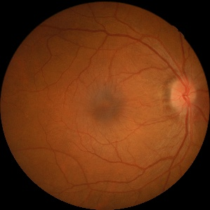 | 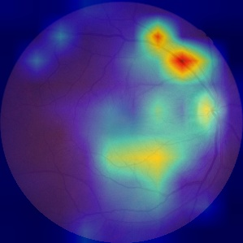 | 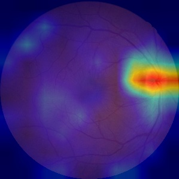 |
| 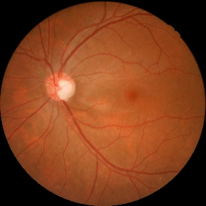 | 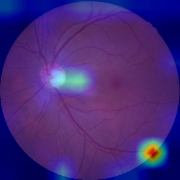 | 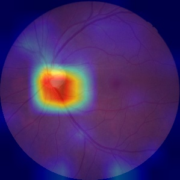 |
| 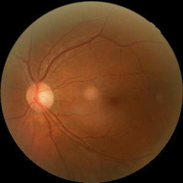 | 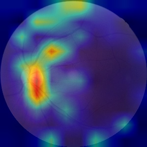 | 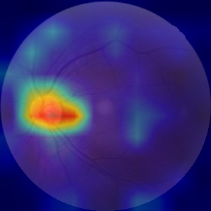 |
| 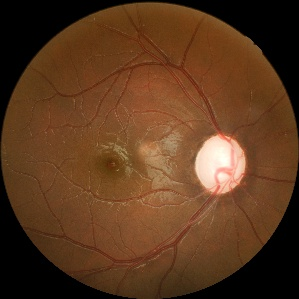 | 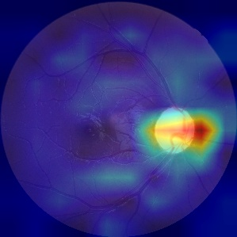 | 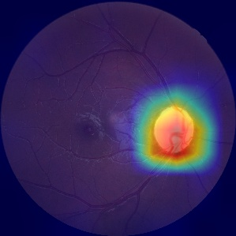 |

> *From left to right: The original retinal image, attention regions captured by standard CBAM, and the refined focus regions captured by our KE-CBAM with anatomical priors.*

### 📌 t-SNE (openTSNE) Feature Dimensionality Reduction Clustering Analysis
Use `tsne_resnet152_3cls.py` and `visualize_tsne.py` to extract deep high-dimensional features of the network and project them into a 2D space, validating the feature separation between different disease subclasses.

| Standard ResNet | 3-Branch + CBAM | 3-Branch + KE-CBAM |
|:---:|:---:|:---:|
| 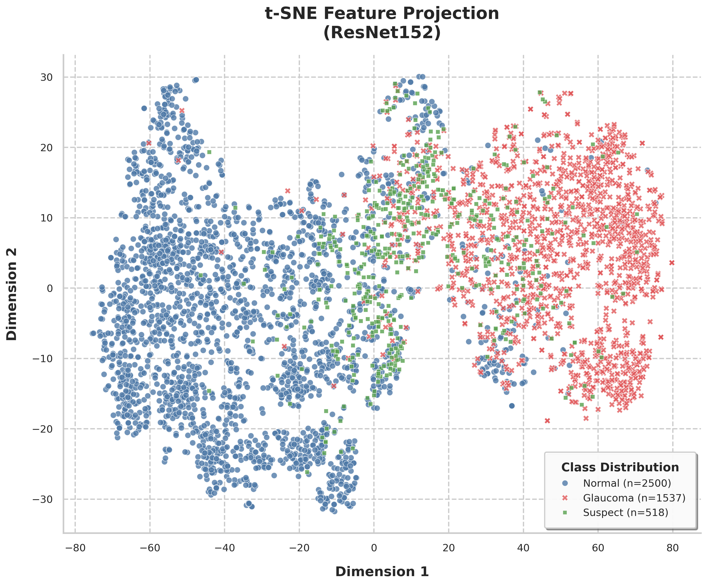 | 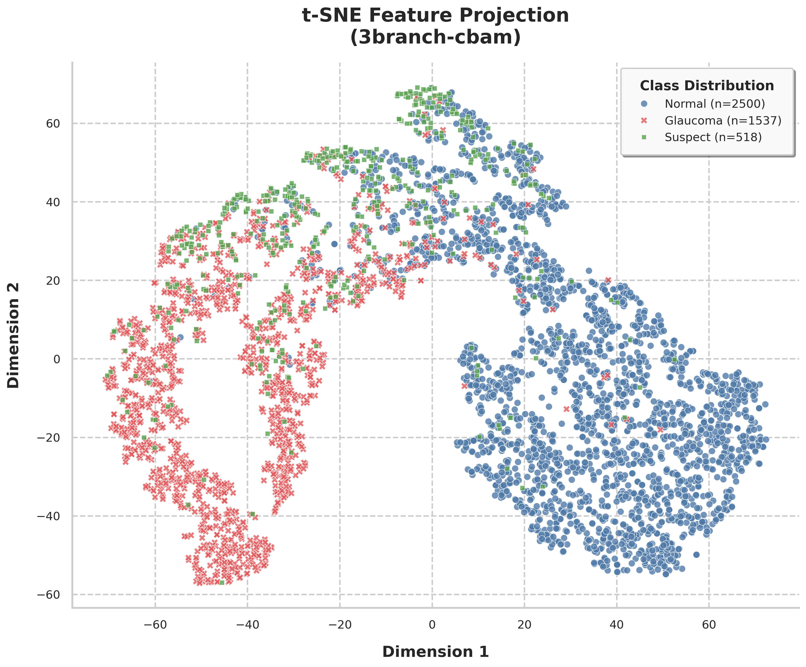 | 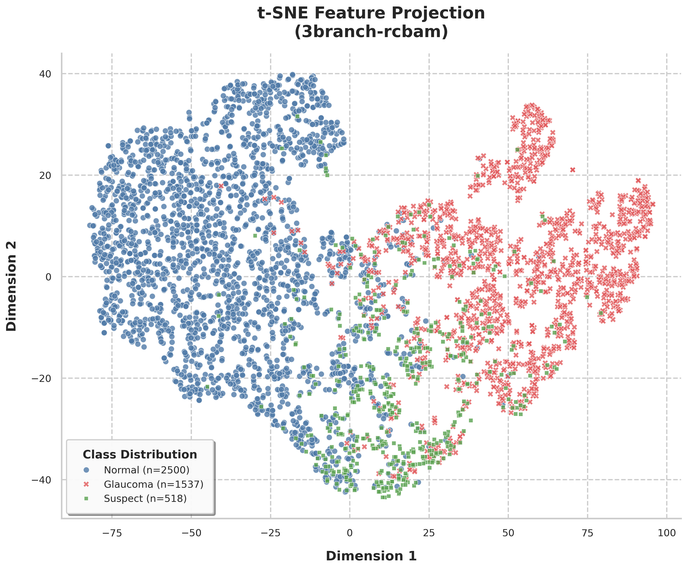 |

> *Comparison of feature distributions. The KE-CBAM enhanced model shows much clearer boundaries and distinct clusters among different glaucoma subclasses compared to baseline networks.*

### 📌 Macro Performance Radar Chart
Run `draw/draw_radar_chart.py` to plot radar charts comparing multiple metrics (AUC, Accuracy, F1-Score, Sensitivity, etc.), visualizing the project's advantages across different dimensions.

---


## 📝 5. Citation & License

If you use the code, infrastructure (such as the RETFound integration scheme, multi-branch KE-CBAM model), or experimental ideas of this system in your research, project, or product, please cite our paper:

```bibtex
@article{YourName202X_Glaucoma,
  title={Your Paper Title Here: A RETFound and KE-CBAM based Approach for Glaucoma Detection},
  author={Lastname, Firstname and Coauthor, Name},
  journal={Name of the Journal or Conference},
  year={202X},
  volume={XX},
  pages={XX-XX},
  publisher={Publisher Name}
}
```

**License:** This project is licensed under the terms specified in [LICENSE.txt](./LICENSE.txt).
